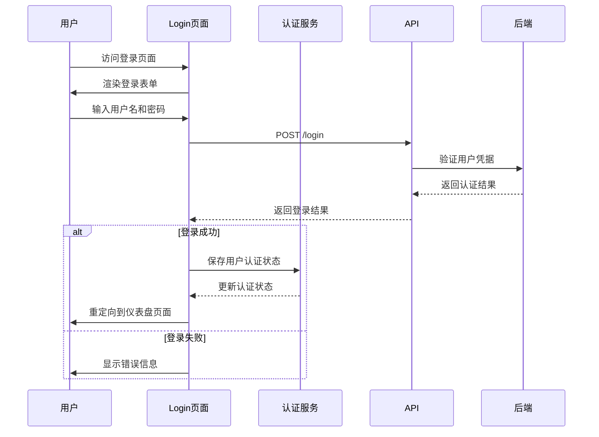
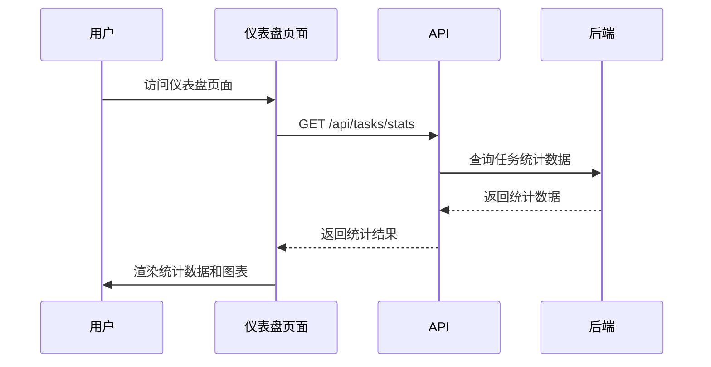
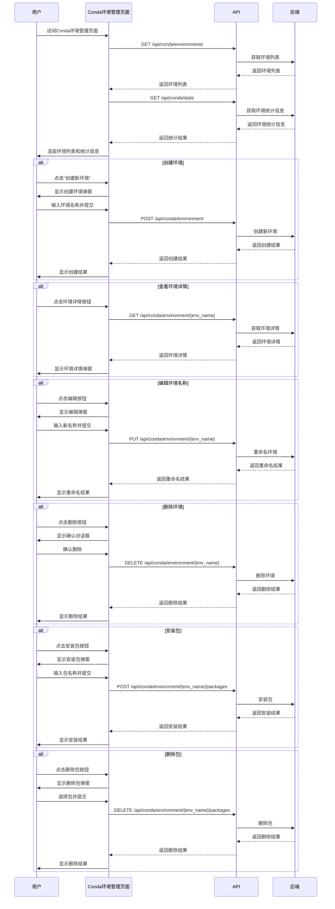
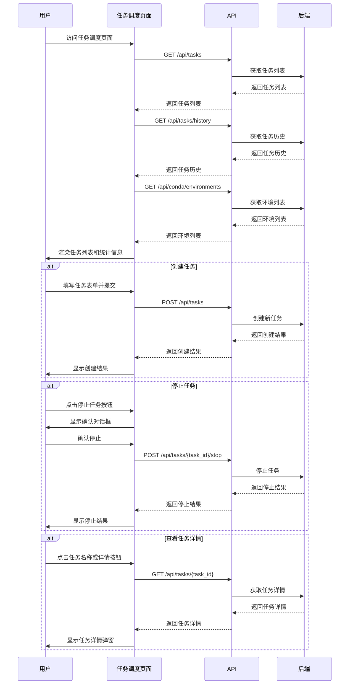
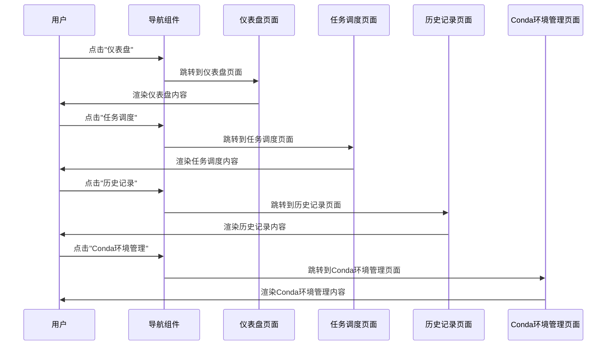
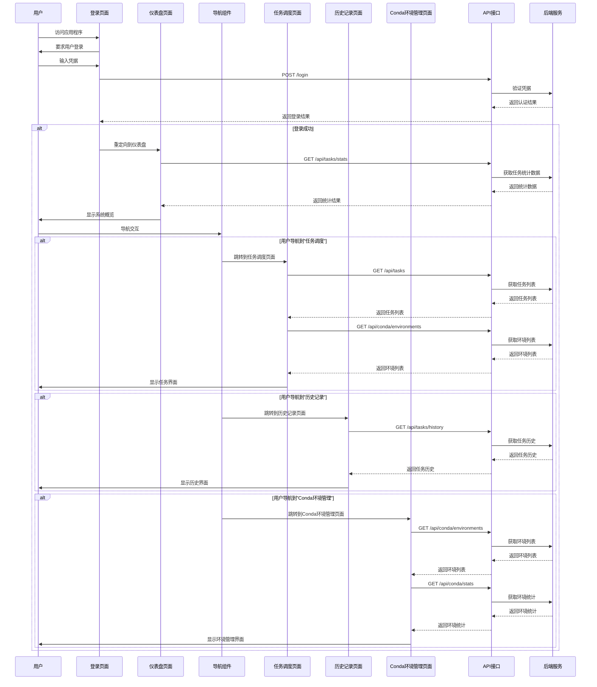

# 页面跳转与API调用时序图

本文档使用 Mermaid 时序图语法描述应用程序中的页面跳转与 API 调用关系。

## 用户登录流程

```mermaid
sequenceDiagram
    participant 用户
    participant Login页面
    participant 认证服务
    participant API
    participant 后端

    用户->>Login页面: 访问登录页面
    Login页面->>用户: 渲染登录表单
    用户->>Login页面: 输入用户名和密码
    Login页面->>API: POST /login
    API->>后端: 验证用户凭据
    后端-->>API: 返回认证结果
    API-->>Login页面: 返回登录结果
    alt 登录成功
        Login页面->>认证服务: 保存用户认证状态
        认证服务-->>Login页面: 更新认证状态
        Login页面->>用户: 重定向到仪表盘页面
    else 登录失败
        Login页面->>用户: 显示错误信息
    end
```

## 仪表盘页面流程

```mermaid
sequenceDiagram
    participant 用户
    participant 仪表盘页面
    participant API
    participant 后端

    用户->>仪表盘页面: 访问仪表盘页面
    仪表盘页面->>API: GET /api/tasks/stats
    API->>后端: 查询任务统计数据
    后端-->>API: 返回统计数据
    API-->>仪表盘页面: 返回统计结果
    仪表盘页面->>用户: 渲染统计数据和图表
```

## Conda环境管理流程

```mermaid
sequenceDiagram
    participant 用户
    participant Conda环境管理页面
    participant API
    participant 后端

    用户->>Conda环境管理页面: 访问Conda环境管理页面
    Conda环境管理页面->>API: GET /api/conda/environments
    API->>后端: 获取环境列表
    后端-->>API: 返回环境列表
    API-->>Conda环境管理页面: 返回环境列表
    Conda环境管理页面->>API: GET /api/conda/stats
    API->>后端: 获取环境统计信息
    后端-->>API: 返回环境统计信息
    API-->>Conda环境管理页面: 返回统计结果
    Conda环境管理页面->>用户: 渲染环境列表和统计信息

    alt 创建环境
        用户->>Conda环境管理页面: 点击"创建新环境"
        Conda环境管理页面->>用户: 显示创建环境弹窗
        用户->>Conda环境管理页面: 输入环境名称并提交
        Conda环境管理页面->>API: POST /api/conda/environment
        API->>后端: 创建新环境
        后端-->>API: 返回创建结果
        API-->>Conda环境管理页面: 返回创建结果
        Conda环境管理页面->>用户: 显示创建结果
    end

    alt 查看环境详情
        用户->>Conda环境管理页面: 点击环境详情按钮
        Conda环境管理页面->>API: GET /api/conda/environment/{env_name}
        API->>后端: 获取环境详情
        后端-->>API: 返回环境详情
        API-->>Conda环境管理页面: 返回环境详情
        Conda环境管理页面->>用户: 显示环境详情弹窗
    end

    alt 编辑环境名称
        用户->>Conda环境管理页面: 点击编辑按钮
        Conda环境管理页面->>用户: 显示编辑弹窗
        用户->>Conda环境管理页面: 输入新名称并提交
        Conda环境管理页面->>API: PUT /api/conda/environment/{env_name}
        API->>后端: 重命名环境
        后端-->>API: 返回重命名结果
        API-->>Conda环境管理页面: 返回重命名结果
        Conda环境管理页面->>用户: 显示重命名结果
    end

    alt 删除环境
        用户->>Conda环境管理页面: 点击删除按钮
        Conda环境管理页面->>用户: 显示确认对话框
        用户->>Conda环境管理页面: 确认删除
        Conda环境管理页面->>API: DELETE /api/conda/environment/{env_name}
        API->>后端: 删除环境
        后端-->>API: 返回删除结果
        API-->>Conda环境管理页面: 返回删除结果
        Conda环境管理页面->>用户: 显示删除结果
    end

    alt 安装包
        用户->>Conda环境管理页面: 点击安装包按钮
        Conda环境管理页面->>用户: 显示安装包弹窗
        用户->>Conda环境管理页面: 输入包名称并提交
        Conda环境管理页面->>API: POST /api/conda/environment/{env_name}/packages
        API->>后端: 安装包
        后端-->>API: 返回安装结果
        API-->>Conda环境管理页面: 返回安装结果
        Conda环境管理页面->>用户: 显示安装结果
    end

    alt 删除包
        用户->>Conda环境管理页面: 点击删除包按钮
        Conda环境管理页面->>用户: 显示删除包弹窗
        用户->>Conda环境管理页面: 选择包并提交
        Conda环境管理页面->>API: DELETE /api/conda/environment/{env_name}/packages
        API->>后端: 删除包
        后端-->>API: 返回删除结果
        API-->>Conda环境管理页面: 返回删除结果
        Conda环境管理页面->>用户: 显示删除结果
    end
```

## 任务调度流程

```mermaid
sequenceDiagram
    participant 用户
    participant 任务调度页面
    participant API
    participant 后端

    用户->>任务调度页面: 访问任务调度页面
    任务调度页面->>API: GET /api/tasks
    API->>后端: 获取任务列表
    后端-->>API: 返回任务列表
    API-->>任务调度页面: 返回任务列表
    任务调度页面->>API: GET /api/tasks/history
    API->>后端: 获取任务历史
    后端-->>API: 返回任务历史
    API-->>任务调度页面: 返回任务历史
    任务调度页面->>API: GET /api/conda/environments
    API->>后端: 获取环境列表
    后端-->>API: 返回环境列表
    API-->>任务调度页面: 返回环境列表
    任务调度页面->>用户: 渲染任务列表和统计信息

    alt 创建任务
        用户->>任务调度页面: 填写任务表单并提交
        任务调度页面->>API: POST /api/tasks
        API->>后端: 创建新任务
        后端-->>API: 返回创建结果
        API-->>任务调度页面: 返回创建结果
        任务调度页面->>用户: 显示创建结果
    end

    alt 停止任务
        用户->>任务调度页面: 点击停止任务按钮
        任务调度页面->>用户: 显示确认对话框
        用户->>任务调度页面: 确认停止
        任务调度页面->>API: POST /api/tasks/{task_id}/stop
        API->>后端: 停止任务
        后端-->>API: 返回停止结果
        API-->>任务调度页面: 返回停止结果
        任务调度页面->>用户: 显示停止结果
    end

    alt 查看任务详情
        用户->>任务调度页面: 点击任务名称或详情按钮
        任务调度页面->>API: GET /api/tasks/{task_id}
        API->>后端: 获取任务详情
        后端-->>API: 返回任务详情
        API-->>任务调度页面: 返回任务详情
        任务调度页面->>用户: 显示任务详情弹窗
    end
```

## 导航跳转流程

```mermaid
sequenceDiagram
    participant 用户
    participant 导航组件
    participant 仪表盘页面
    participant 任务调度页面
    participant 历史记录页面
    participant Conda环境管理页面

    用户->>导航组件: 点击"仪表盘"
    导航组件->>仪表盘页面: 跳转到仪表盘页面
    仪表盘页面->>用户: 渲染仪表盘内容

    用户->>导航组件: 点击"任务调度"
    导航组件->>任务调度页面: 跳转到任务调度页面
    任务调度页面->>用户: 渲染任务调度内容

    用户->>导航组件: 点击"历史记录"
    导航组件->>历史记录页面: 跳转到历史记录页面
    历史记录页面->>用户: 渲染历史记录内容

    用户->>导航组件: 点击"Conda环境管理"
    导航组件->>Conda环境管理页面: 跳转到Conda环境管理页面
    Conda环境管理页面->>用户: 渲染Conda环境管理内容
```

## 整体页面流转与API调用关系

```mermaid
sequenceDiagram
    participant 用户
    participant 登录页面
    participant 仪表盘页面
    participant 导航组件
    participant 任务调度页面
    participant 历史记录页面
    participant Conda环境管理页面
    participant API接口
    participant 后端服务

    用户->>登录页面: 访问应用程序
    登录页面->>用户: 要求用户登录
    用户->>登录页面: 输入凭据
    登录页面->>API接口: POST /login
    API接口->>后端服务: 验证凭据
    后端服务-->>API接口: 返回认证结果
    API接口-->>登录页面: 返回登录结果
    
    alt 登录成功
        登录页面->>仪表盘页面: 重定向到仪表盘
        仪表盘页面->>API接口: GET /api/tasks/stats
        API接口->>后端服务: 获取任务统计数据
        后端服务-->>API接口: 返回统计数据
        API接口-->>仪表盘页面: 返回统计结果
        仪表盘页面->>用户: 显示系统概览

        用户->>导航组件: 导航交互
        
        alt 用户导航到"任务调度"
            导航组件->>任务调度页面: 跳转到任务调度页面
            任务调度页面->>API接口: GET /api/tasks
            API接口->>后端服务: 获取任务列表
            后端服务-->>API接口: 返回任务列表
            API接口-->>任务调度页面: 返回任务列表
            任务调度页面->>API接口: GET /api/conda/environments
            API接口->>后端服务: 获取环境列表
            后端服务-->>API接口: 返回环境列表
            API接口-->>任务调度页面: 返回环境列表
            任务调度页面->>用户: 显示任务界面
        end
        
        alt 用户导航到"历史记录"
            导航组件->>历史记录页面: 跳转到历史记录页面
            历史记录页面->>API接口: GET /api/tasks/history
            API接口->>后端服务: 获取任务历史
            后端服务-->>API接口: 返回任务历史
            API接口-->>历史记录页面: 返回任务历史
            历史记录页面->>用户: 显示历史界面
        end
        
        alt 用户导航到"Conda环境管理"
            导航组件->>Conda环境管理页面: 跳转到Conda环境管理页面
            Conda环境管理页面->>API接口: GET /api/conda/environments
            API接口->>后端服务: 获取环境列表
            后端服务-->>API接口: 返回环境列表
            API接口-->>Conda环境管理页面: 返回环境列表
            Conda环境管理页面->>API接口: GET /api/conda/stats
            API接口->>后端服务: 获取环境统计
            后端服务-->>API接口: 返回环境统计
            API接口-->>Conda环境管理页面: 返回环境统计
            Conda环境管理页面->>用户: 显示环境管理界面
        end
    end
```